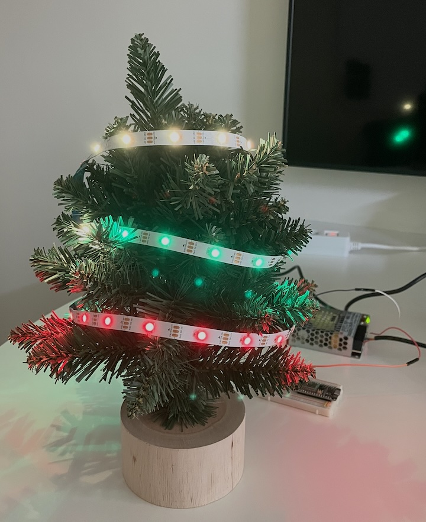
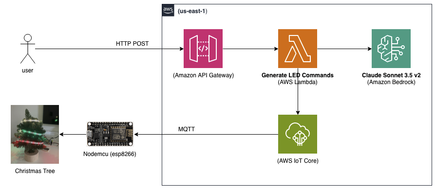
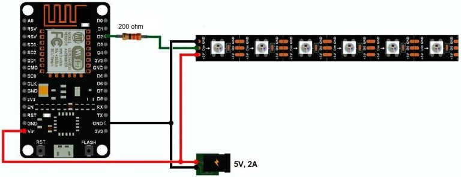

# Chat X-Mas tree with LED lights



## 1. Overview
Make your dancing light on Christmas tree by your words.

For more Demos, please see here: [Christmas Tree Demo](docs/demo.md)


### Disclaimer

> * This project is only a **prototype** for a demo of Amazon Bedrock and AWS IoT Core, and **does not consider a production** environment.


## 2. Setup and Install
This project tested on MacBook Pro(M1) and AWS us-east-1 region.
Quick setup and install guide is here : [Install Guide](install.md)

## 3. Run Application
Request via HTTP Rest api to generate and run command. Put API Gateway url from and set led count and query sentence as parameters.
```
curl -X POST -H "Accept: application/json" <API_GATEWAY_URL> -d '{"num_of_leds":<LED_COUNBTS>, "query": <QUERY_SENTENCE>}'
```

For example,
```
curl -X POST https://XXXXXXXXXX.execute-api.us-east-1.amazonaws.com/prod/led -H "Accept: application/json" -d '{"num_of_leds":30,"query":"I want to joyful Christmas party with SantaClaus."}'
```

## 4. Architecture

### 4.1 Application
Generate LED control command using Amazon Bedrock and send commands to Nodemcu board via AWS IoT Core and show lights


### 4.2 Device wiring
Nodemcu and Neopixel WS2812B LED strip wirings.
Put 220ohm register on signal pin, and connected to digital out pin.
If you have 4 or more LED lights, external power-supply recommended. Each of WS2812B consumes 60mA. 
Sample schematic circuit digram is below.
For more inforemation, visit [Blynk Controlled WS2812B Neopixel LED Strip with NodeMCU](https://how2electronics.com/ws2812b-neopixel-led-strip-nodemcu/)



## 5. License
MIT-0
