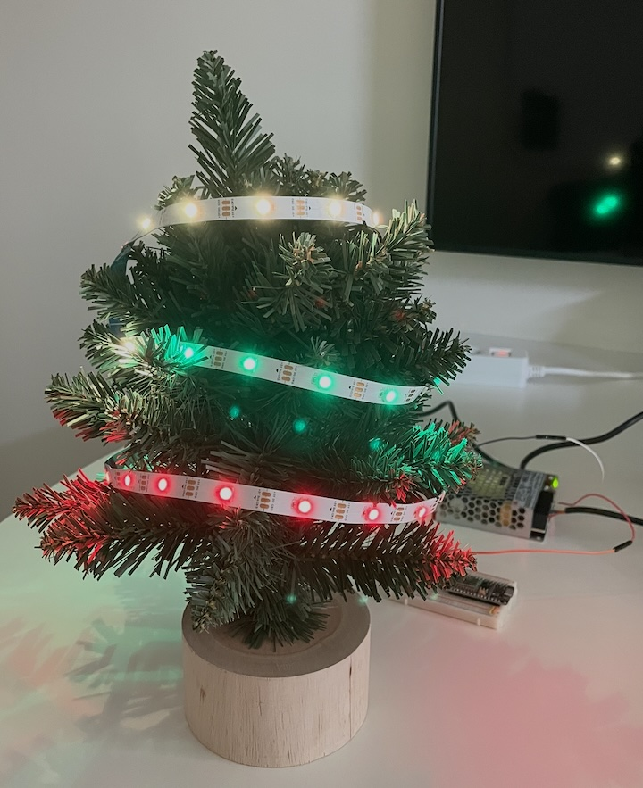

# Christmas Tree Demo
Here are few Christmas tree demos


## 1. Chrismas 
* I want to joyful Christmas party with SantaClaus.




```json
{
  "commands": [
    { "cmd": "set", "led_id_from": 0, "led_id_to": 29, "color": [0, 0, 0] },
    { "cmd": "set", "led_id_from": 0, "led_id_to": 9, "color": [255, 0, 0] },
    { "cmd": "set", "led_id_from": 10, "led_id_to": 19, "color": [0, 255, 0] },
    { "cmd": "set", "led_id_from": 20, "led_id_to": 29, "color": [255, 255, 255] },
    { "cmd": "sleep", "milis": 1000 },
    { "cmd": "set", "led_id_from": 0, "led_id_to": 9, "color": [0, 255, 0] },
    { "cmd": "set", "led_id_from": 10, "led_id_to": 19, "color": [255, 255, 255] },
    { "cmd": "set", "led_id_from": 20, "led_id_to": 29, "color": [255, 0, 0] },
    { "cmd": "sleep", "milis": 1000 },
    { "cmd": "set", "led_id_from": 0, "led_id_to": 9, "color": [255, 255, 255] },
    { "cmd": "set", "led_id_from": 10, "led_id_to": 19, "color": [255, 0, 0] },
    { "cmd": "set", "led_id_from": 20, "led_id_to": 29, "color": [0, 255, 0] },
    { "cmd": "sleep", "milis": 1000 },
    { "cmd": "set", "led_id_from": 0, "led_id_to": 29, "color": [255, 255, 255] },
    { "cmd": "sleep", "milis": 500 },
    { "cmd": "set", "led_id_from": 0, "led_id_to": 29, "color": [255, 0, 0] },
    { "cmd": "sleep", "milis": 500 },
    { "cmd": "set", "led_id_from": 0, "led_id_to": 29, "color": [0, 255, 0] },
    { "cmd": "sleep", "milis": 500 },
    { "cmd": "repeat", "repeat": true }
  ]
}
```


## 2. Aurora
* Create a mystical tree at night with rainbow-colored eyes falling like snowflakes around it, creating an aurora-like glow in the darkness.


```json
{
  "commands": [
    { "cmd": "set", "led_id_from": 0, "led_id_to": 29, "color": [0, 0, 0] },
    { "cmd": "set", "led_id_from": 10, "led_id_to": 19, "color": [102, 51, 0] },
    { "cmd": "sleep", "milis": 2000 },
    { "cmd": "set", "led_id_from": 0, "led_id_to": 9, "color": [77, 102, 0] },
    { "cmd": "set", "led_id_from": 20, "led_id_to": 29, "color": [51, 77, 0] },
    { "cmd": "sleep", "milis": 2000 },
    { "cmd": "set", "led_id_from": 5, "led_id_to": 5, "color": [255, 0, 0] },
    { "cmd": "sleep", "milis": 200 },
    { "cmd": "set", "led_id_from": 5, "led_id_to": 5, "color": [0, 0, 0] },
    { "cmd": "set", "led_id_from": 15, "led_id_to": 15, "color": [255, 165, 0] },
    { "cmd": "sleep", "milis": 200 },
    { "cmd": "set", "led_id_from": 15, "led_id_to": 15, "color": [0, 0, 0] },
    { "cmd": "set", "led_id_from": 25, "led_id_to": 25, "color": [0, 255, 0] },
    { "cmd": "sleep", "milis": 200 },
    { "cmd": "set", "led_id_from": 25, "led_id_to": 25, "color": [0, 0, 0] },
    { "cmd": "set", "led_id_from": 10, "led_id_to": 10, "color": [0, 0, 255] },
    { "cmd": "sleep", "milis": 200 },
    { "cmd": "set", "led_id_from": 10, "led_id_to": 10, "color": [0, 0, 0] },
    { "cmd": "set", "led_id_from": 20, "led_id_to": 20, "color": [75, 0, 130] },
    { "cmd": "sleep", "milis": 200 },
    { "cmd": "set", "led_id_from": 20, "led_id_to": 20, "color": [0, 0, 0] },
    { "cmd": "repeat", "repeat": true }
  ]
}
```


## 3. Iron Man
* Describe the Iron man.


```json
{
  "commands": [
    { "cmd": "set", "led_id_from": 0, "led_id_to": 29, "color": [255, 0, 0] },
    { "cmd": "sleep", "milis": 2000 },
    { "cmd": "set", "led_id_from": 5, "led_id_to": 9, "color": [255, 165, 0] },
    { "cmd": "set", "led_id_from": 10, "led_id_to": 14, "color": [255, 255, 0] },
    { "cmd": "sleep", "milis": 2000 },
    { "cmd": "set", "led_id_from": 15, "led_id_to": 19, "color": [173, 216, 230] },
    { "cmd": "set", "led_id_from": 20, "led_id_to": 24, "color": [0, 191, 255] },
    { "cmd": "sleep", "milis": 2000 },
    { "cmd": "set", "led_id_from": 0, "led_id_to": 29, "color": [0, 0, 0] },
    { "cmd": "sleep", "milis": 1000 },
    { "cmd": "repeat", "repeat": true }
  ]
}
```
